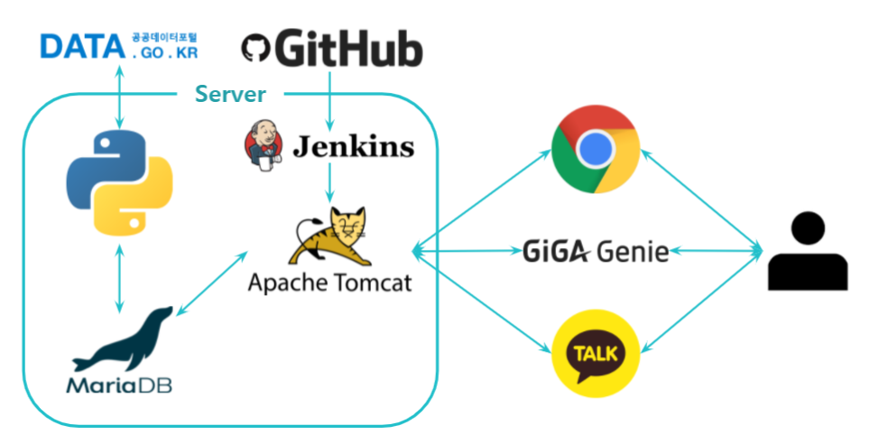

## 프로젝트 구조

 

## GiGA Genie 구현 기능

    
실시간 확진자 수 조회

    발화 : 오늘 ( ~지역) 확진자 수 알려줘 
    내용 : 실시간 확진자 정보를 TTS로 제공 (지역별로도 알려줌)

    
누적 확진자 수 조회

    발화 : 어제 ( ~지역) 확진자 수 알려줘 
    내용 : 누적 확진자 정보를 TTS로 제공 (지역별로도 알려줌)

    
진료소 위치 조회

    발화 : 가까운 진료소 알려줘 
    내용 : naver geolocation을 사용하여 현재 접속위치를 알아내고, 
    &nbsp;&nbsp;&nbsp;&nbsp;&nbsp;&nbsp;&nbsp;&nbsp;&nbsp;&nbsp;가까운 진료소명과 주소를 TTS로 제공

    
뉴스 기사 조회

    발화 : 코로나 뉴스 알려줘 
    내용 : 네이버 검색엔진 기준 최신 코로나 뉴스의 제목을 한 줄 크롤링하여 TTS로 제공 
    &nbsp;&nbsp;&nbsp;&nbsp;&nbsp;&nbsp;&nbsp;&nbsp;&nbsp;&nbsp;(다른 키워드의 뉴스도 검색가능)

    
날씨 조회

    발화 : 오늘 날씨 알려줘 
    내용 : naver geolocation으로 현재 접속위치를 알아낸 후 
    &nbsp;&nbsp;&nbsp;&nbsp;&nbsp;&nbsp;&nbsp;&nbsp;&nbsp;&nbsp;공공데이터 API로 날씨 데이터를 받아와 스피커에서 TTS서비스로 제공한다

 

